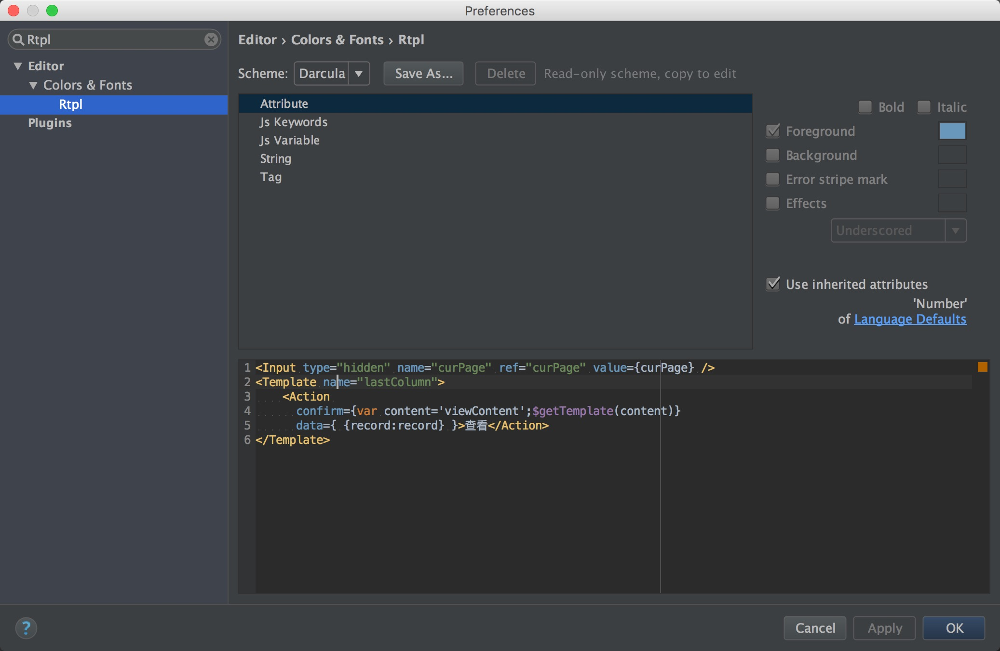

# RtplPlugin
An idea highlight plugin for Rtpl

## 安装
* 方式一
	
	1. 下载[RtplPlugin.jar](https://raw.githubusercontent.com/LichFaker/RtplPlugin/master/RtplPlugin.jar)
	2. 从本地安装插件， 在idea->preferences->plugin中：
		
	3. 重启idea
* 方式二
	
	在plugin->browse repositories中搜索RtplPlugin， 安装重启
	
## 特性

* 高亮Rtpl
* 常见错误提示
* 自定义高亮颜色
	
	

